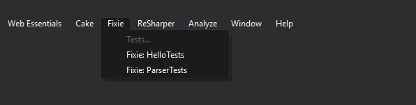

## VisualStudio.Fixie

Visual Studio extension that allow executing single test from Main Menu.

## Condition

- Project name must contains `Tests`
- Test file must ends with `Tests` or `Spec`

## Setup

### 1. Add fixie convention to test project.

```csharp
public class ClassConvention : Convention {
    public ClassConvention() {
        var target = ConfigurationManager.AppSettings.Get("fixie");
        Classes.Where(x => x.Name == target);
    }
}
```

### 2. Create cake task

```csharp
Task("fixie")
    .Does(() => {
        var config = testDll + ".config";
        var className = Argument("className", "");
        TransformConfig(config, new TransformationCollection {
                { "configuration/appSettings/add[@key='fixie']/@value", className }
        });
        Fixie(testDll);
    });
```

### 3. Execute test from Fixie Menu

